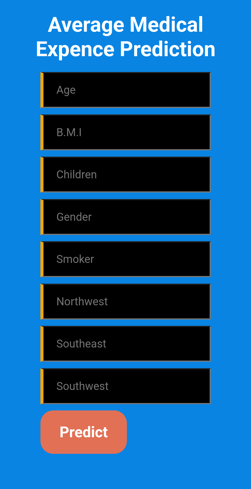

# Medical Bill Prediction.



## Software & Tools used

1) [Github](https://github.com/)
2) [Heroku](https://heroku.com)
3) [VSCodeIDE](https://code.visualstudio.com/)
4) [Git](https://www.atlassian.com/git/tutorials/install-git)

Create a new Environment

```
conda create -p New_Env python==3.7 -y
```
